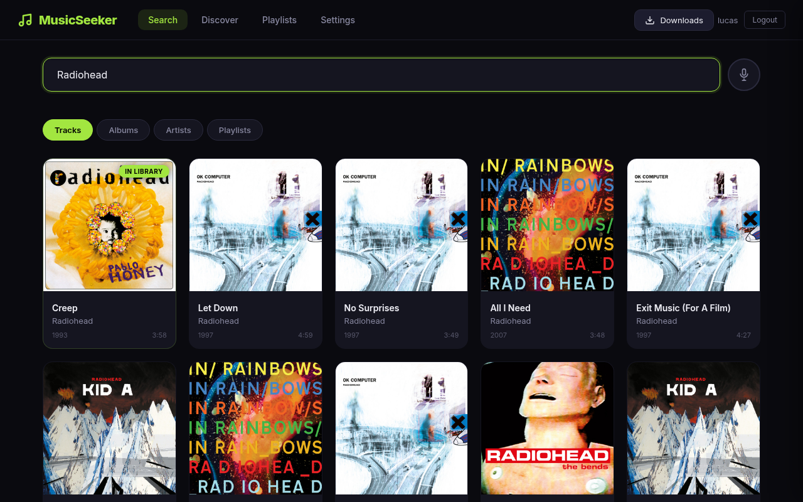
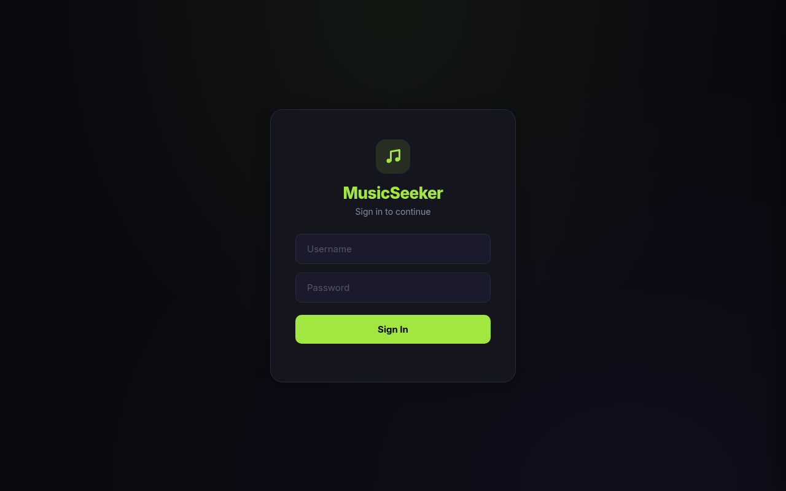
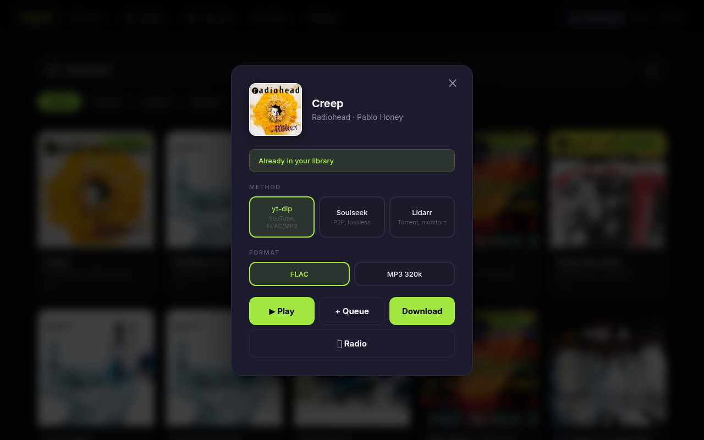
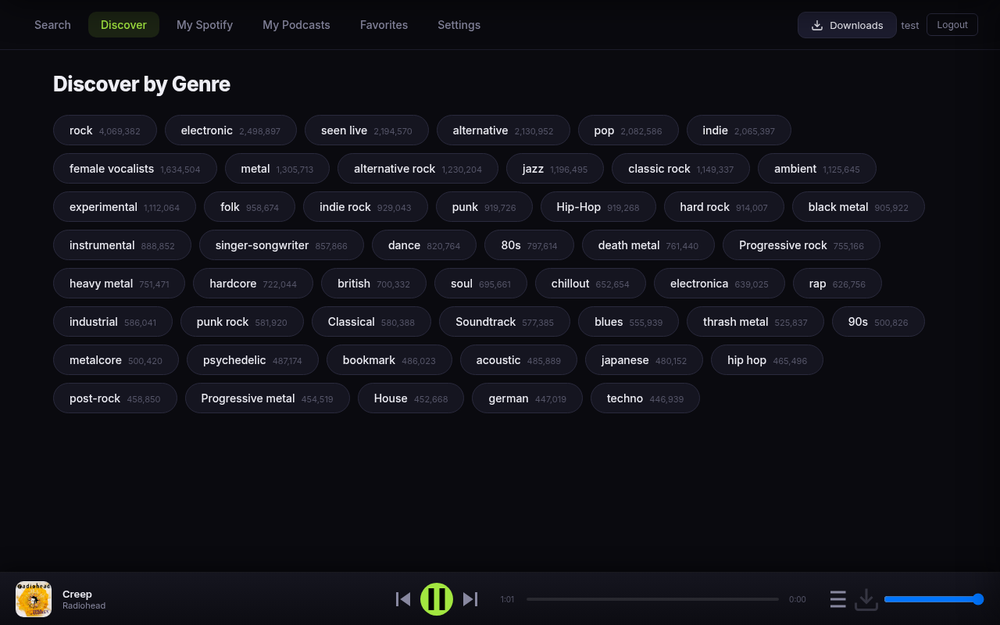
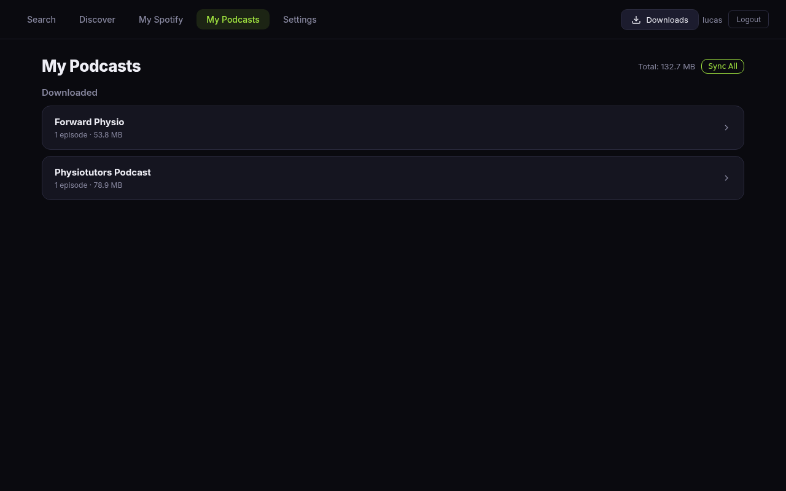
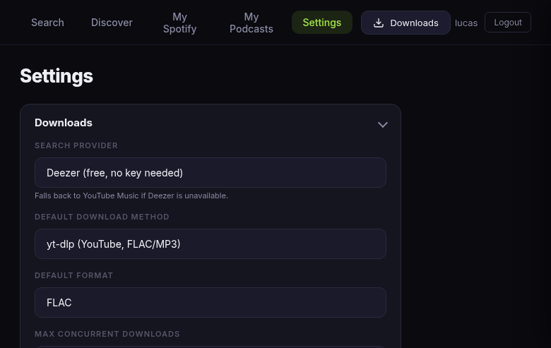
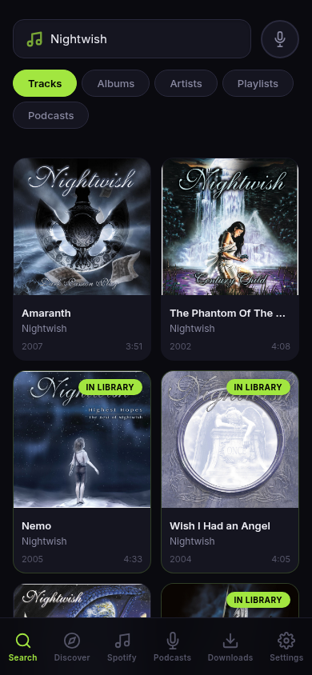

# MusicSeeker

A self-hosted web app for searching and downloading music. Think Jellyseerr, but for music.

Built with FastAPI + vanilla JS. Runs as a single Docker container.



## Features

- **Multi-Provider Search** — Search tracks, albums, artists, and playlists via Deezer (default, no API key needed), YouTube Music, or Spotify — configurable in Settings with automatic fallback
- **Discover** — Browse music by genre tags (rock, jazz, electronic, etc.) powered by Last.fm, with infinite scroll and filtering
- **Three download methods:**
  - **yt-dlp** — Download from YouTube in FLAC or MP3 with Spotify metadata (artist, title, album) and album art embedded
  - **Soulseek (slskd)** — P2P downloads via Soulseek network, auto-selects best quality (prefers FLAC)
  - **Lidarr** — Torrent-based downloads with automatic artist monitoring
- **Song Recognition** — Identify songs via your microphone using Shazam, with AcoustID fingerprinting as fallback, then download them instantly
- **Spotify Playlists** — Browse your own or search public Spotify playlists and download individual tracks or full playlists with optional Navidrome playlist creation
- **Liked Songs** — Access and download your Spotify Liked Songs as a playlist, with Navidrome playlist sync
- **Podcasts** — Search and download podcast episodes from Spotify, manage downloaded shows, subscribe for auto-sync of new episodes
- **Smart Downloads** — Checks your Navidrome library before downloading and skips tracks you already have
- **Library Detection** — Shows "In Library" badge for tracks already in your Navidrome collection (fuzzy matching handles remasters, feat. tags, etc.)
- **Per-User Download Folders** — Each user's downloads go to `/music/{username}/`, with disk usage tracking and per-user cleanup in Settings
- **Download Management** — Real-time progress tracking, retry failed downloads, cancel running downloads
- **In-Browser Player** — Preview tracks before downloading with a built-in streaming player. Streams from Navidrome (library-first) or YouTube via yt-dlp/ffmpeg proxy. Per-user persistent queue with position syncs across devices. Play/pause/next/prev controls, volume, Media Session API for lock screen controls. Download current track directly from the player bar
- **Browser Notifications** — Get notified when downloads complete (even in background tabs)
- **User Management** — JWT authentication with admin/user roles, per-user format/method permissions
- **Modern UI** — Spotify-inspired dark theme with lime green accent, Inter font, glassmorphism nav, bottom tab bar on mobile, bottom-sheet modals, and responsive card grid

## Screenshots

| Login | Search | Download Modal |
|-------|--------|---------------|
|  |  |  |

| Discover | Podcasts | Settings (Disk Usage) | Mobile |
|----------|----------|-----------------------|--------|
|  |  |  |  |

## Requirements

- Docker & Docker Compose
- *(Optional)* [Spotify Developer App](https://developer.spotify.com/dashboard) (needed for Spotify search provider, personal playlists, Liked Songs, and podcasts)
- *(Optional)* [slskd](https://github.com/slskd/slskd) instance for Soulseek P2P downloads (included in docker-compose)
- *(Optional)* Lidarr instance for torrent-based downloads
- *(Optional)* Navidrome instance for library detection and playlist sync
- *(Optional)* [Last.fm API key](https://www.last.fm/api/account/create) for genre-based discovery (Discover tab)
- *(Optional)* [AcoustID API key](https://acoustid.org/my-applications) for fingerprint-based recognition fallback

> **Note:** Search works out of the box with Deezer (default) or YouTube Music — no API keys required. Spotify credentials are only needed if you want to use Spotify as your search provider, browse your personal playlists/Liked Songs, or search podcasts.

## Quick Start

### 1. Clone the repository

```bash
git clone https://github.com/lucashanak/music-seeker.git
cd music-seeker
```

### 2. Configure environment

```bash
cp .env.example .env
```

Edit `.env` with your credentials:

```env
# Required
MUSIC_DIR=/music
ADMIN_USER=admin
ADMIN_PASS=your_secure_password

# Search provider (default: deezer). Options: deezer, ytmusic, spotify
SEARCH_PROVIDER=deezer

# Optional — Spotify (needed for Spotify search, playlists, Liked Songs, podcasts)
SPOTIFY_CLIENT_ID=your_client_id
SPOTIFY_CLIENT_SECRET=your_client_secret
SPOTIFY_REFRESH_TOKEN=your_refresh_token

# Optional (for Last.fm Discover tab)
LASTFM_API_KEY=your_lastfm_key

# Optional (for AcoustID recognition fallback)
ACOUSTID_API_KEY=your_acoustid_key

# Optional (for Lidarr integration)
LIDARR_URL=http://lidarr:8686
LIDARR_API_KEY=your_api_key

# Optional (for "In Library" detection and playlist sync)
NAVIDROME_URL=http://navidrome:4533
NAVIDROME_USER=your_user
NAVIDROME_PASSWORD=your_password

# Optional (for Soulseek downloads via slskd)
SLSKD_URL=http://slskd:5030
SLSKD_API_KEY=your_slskd_api_key
```

### 3. Start the app

```bash
docker compose up -d --build
```

This starts MusicSeeker, Navidrome, and slskd. The app will be available at `http://localhost:8090`.

- Navidrome: `http://localhost:4533` (configure on first access)
- slskd: `http://localhost:5030` (configure Soulseek credentials via its web UI)

### 4. Log in

Use the admin credentials you set in `.env`. You can create additional users from the Settings page.

## Download Methods

### yt-dlp (default)
Searches YouTube for the track and downloads the audio. Metadata (artist, title, album) and album art are sourced from the search provider (Deezer/Spotify) and embedded into the file. Supports FLAC and MP3 output formats.

### Soulseek (slskd)
Downloads from the Soulseek peer-to-peer network via a self-hosted [slskd](https://github.com/slskd/slskd) instance. Auto-selects the best quality file (prefers FLAC, higher bitrate). Requires a Soulseek account — see [Setting up slskd](#setting-up-slskd) below.

### Lidarr
Adds the artist to Lidarr and triggers a search. Lidarr handles the actual download via torrent indexers in the background. Good for monitoring entire discographies.

## Getting a Spotify Refresh Token

Search works without Spotify credentials using Deezer (default) or YouTube Music. Spotify credentials are only needed if you want to use Spotify as your search provider, browse your personal playlists/Liked Songs, or search podcasts. A refresh token is additionally needed for browsing your personal playlists and Liked Songs. When Spotify credentials are missing, dependent features are gracefully greyed out.

1. Go to [Spotify Developer Dashboard](https://developer.spotify.com/dashboard) and create an app
2. Set the Redirect URI to `http://localhost:8888/callback`
3. Note your **Client ID** and **Client Secret**
4. Open this URL in your browser (replace `YOUR_CLIENT_ID`):

```
https://accounts.spotify.com/authorize?client_id=YOUR_CLIENT_ID&response_type=code&redirect_uri=http://localhost:8888/callback&scope=user-read-private%20playlist-read-private%20playlist-read-collaborative%20user-library-read
```

5. After authorizing, you'll be redirected to `http://localhost:8888/callback?code=AUTHORIZATION_CODE`
6. Copy the `code` parameter and exchange it for tokens:

```bash
curl -X POST https://accounts.spotify.com/api/token \
  -H "Content-Type: application/x-www-form-urlencoded" \
  -d "grant_type=authorization_code" \
  -d "code=AUTHORIZATION_CODE" \
  -d "redirect_uri=http://localhost:8888/callback" \
  -d "client_id=YOUR_CLIENT_ID" \
  -d "client_secret=YOUR_CLIENT_SECRET"
```

7. The response will contain a `refresh_token` — put it in your `.env` file.

## Setting up slskd

slskd is a self-hosted Soulseek client included in the docker-compose file. To enable Soulseek downloads:

### 1. Configure Soulseek credentials

Create `slskd-data/slskd.yml` with your Soulseek username and password (slskd will register the account automatically if it doesn't exist):

```yaml
soulseek:
  username: your_soulseek_username
  password: your_soulseek_password

directories:
  incomplete: /music/.slskd-incomplete
  downloads: /music/.slskd-downloads

web:
  authentication:
    api_keys:
      - key: your-api-key-here
        role: administrator
```

See `slskd.yml.example` for a full example.

### 2. Create download directories

```bash
mkdir -p music/.slskd-incomplete music/.slskd-downloads
```

### 3. Start slskd

```bash
docker compose up -d slskd
```

### 4. Set the API key in MusicSeeker

Go to MusicSeeker **Settings** and paste your slskd API key (the `key` value from `slskd.yml`).

That's it — slskd will connect to the Soulseek network and MusicSeeker can now search and download via Soulseek.

## Integration with YAMS

If you're running [YAMS](https://yams.media) (Yet Another Media Server), add MusicSeeker to your `docker-compose.custom.yaml`:

```yaml
services:
  music-seeker:
    build: /path/to/music-seeker
    container_name: music-seeker
    restart: unless-stopped
    ports:
      - "8090:8090"
    environment:
      - SPOTIFY_CLIENT_ID=${SPOTIFY_CLIENT_ID}
      - SPOTIFY_CLIENT_SECRET=${SPOTIFY_CLIENT_SECRET}
      - SPOTIFY_REFRESH_TOKEN=${SPOTIFY_REFRESH_TOKEN}
      - LIDARR_URL=http://lidarr:8686
      - LIDARR_API_KEY=${LIDARR_API_KEY}
      - MUSIC_DIR=/music
      - NAVIDROME_URL=http://navidrome:4533
      - NAVIDROME_USER=your_user
      - NAVIDROME_PASSWORD=${NAVIDROME_PASSWORD}
      - LASTFM_API_KEY=${LASTFM_API_KEY}
      - SLSKD_URL=http://slskd:5030
      - SLSKD_API_KEY=${SLSKD_API_KEY}
      - ADMIN_USER=admin
      - ADMIN_PASS=${ADMIN_PASS}
    volumes:
      - /mnt/nas/Media/_Music:/music
      - ${INSTALL_DIRECTORY}/config/music-seeker:/app/data
```

## Architecture

```
┌──────────────────────────────┐
│        Browser (SPA)         │
│   Vanilla JS + Dark Theme    │
└────────────┬─────────────────┘
             │ HTTP/JSON
┌────────────▼─────────────────┐
│     FastAPI (main.py)        │
│  Auth, Search, Downloads,    │
│  Recognition, Discover,      │
│  Settings                    │
├──────────────────────────────┤
│ search_providers.py │ Deezer + YTMusic│
│ spotify.py  │ Spotify Web API│
│ lastfm.py   │ Last.fm API   │
│ downloader.py │ yt-dlp / slskd / Lidarr│
│ library.py  │ Subsonic API   │
│ recognize.py│ shazamio+acoustid│
│ podcasts.py │ Subscriptions   │
│ player.py   │ Streaming+Queue │
│ auth.py     │ HMAC tokens    │
│ jobs.py     │ Job queue      │
└──────────────────────────────┘
```

- **No database** — users and settings stored as JSON files in `/app/data`
- **No build step** — frontend is a single HTML file served by FastAPI
- **yt-dlp runs in-process** — downloads run as subprocesses with Spotify metadata post-processing
- **slskd integration** — REST API calls to self-hosted Soulseek client

## API Reference

All endpoints (except login and version) require `Authorization: Bearer <token>` header.

| Method | Endpoint | Description |
|--------|----------|-------------|
| `GET` | `/api/version` | Get app version (public) |
| `POST` | `/api/auth/login` | Login, returns JWT token |
| `GET` | `/api/auth/me` | Get current user info |
| `GET` | `/api/search?q=...&type=track&offset=0` | Search music (via configured provider) |
| `POST` | `/api/download` | Start a download job |
| `GET` | `/api/jobs` | List all jobs |
| `GET` | `/api/jobs/:id` | Get job status |
| `DELETE` | `/api/jobs/:id` | Cancel a job |
| `POST` | `/api/jobs/:id/retry` | Retry a failed job |
| `DELETE` | `/api/jobs` | Clear download history |
| `POST` | `/api/library/check` | Check if items exist in Navidrome |
| `POST` | `/api/recognize` | Identify song from audio (multipart) |
| `GET` | `/api/spotify/playlists` | Get user's Spotify playlists |
| `GET` | `/api/spotify/liked` | Get user's Liked Songs |
| `GET` | `/api/spotify/playlist/:id/tracks` | Get playlist tracks |
| `GET` | `/api/discover/tags` | Get popular Last.fm genre tags |
| `GET` | `/api/discover/tag/:tag?type=track` | Get top items for a tag |
| `POST` | `/api/discover/resolve` | Resolve Last.fm item via search provider |
| `GET` | `/api/podcasts` | List downloaded podcast shows |
| `GET` | `/api/podcasts/:show` | List episodes for a show |
| `DELETE` | `/api/podcasts/:show` | Delete entire show |
| `DELETE` | `/api/podcasts/:show/:episode` | Delete single episode |
| `GET` | `/api/podcasts/subs` | List podcast subscriptions |
| `POST` | `/api/podcasts/subs` | Subscribe to a podcast |
| `DELETE` | `/api/podcasts/subs/:id` | Unsubscribe from a podcast |
| `PUT` | `/api/podcasts/subs/:id` | Update subscription settings |
| `POST` | `/api/podcasts/sync` | Manually sync all subscriptions |
| `GET` | `/api/player/stream?name=..&artist=..` | Stream audio (Navidrome or YouTube proxy) |
| `GET` | `/api/player/queue` | Get user's player queue |
| `PUT` | `/api/player/queue` | Save player queue state |
| `POST` | `/api/player/queue/add` | Add tracks to queue |
| `DELETE` | `/api/player/queue` | Clear player queue |
| `GET` | `/api/settings` | Get app settings |
| `PUT` | `/api/settings` | Update settings (admin only) |
| `GET` | `/api/users` | List users (admin only) |
| `POST` | `/api/users` | Create user (admin only) |
| `DELETE` | `/api/users/:username` | Delete user (admin only) |
| `PUT` | `/api/users/:username/password` | Change password |
| `GET` | `/api/admin/disk-usage` | Get per-folder disk usage (admin) |
| `DELETE` | `/api/admin/disk-usage/:dirname` | Delete a download folder (admin) |

## Environment Variables

| Variable | Required | Default | Description |
|----------|----------|---------|-------------|
| `SEARCH_PROVIDER` | No | `deezer` | Search provider: `deezer`, `ytmusic`, or `spotify` |
| `SPOTIFY_CLIENT_ID` | No | — | Spotify app Client ID (needed for Spotify search, playlists, podcasts) |
| `SPOTIFY_CLIENT_SECRET` | No | — | Spotify app Client Secret |
| `SPOTIFY_REFRESH_TOKEN` | No | — | Spotify OAuth refresh token (only needed for your own playlists) |
| `ADMIN_USER` | Yes | `admin` | Initial admin username |
| `ADMIN_PASS` | Yes | — | Initial admin password |
| `MUSIC_DIR` | No | `/music` | Music dir inside the container |
| `LIDARR_URL` | No | `http://lidarr:8686` | Lidarr API URL |
| `LIDARR_API_KEY` | No | — | Lidarr API key |
| `NAVIDROME_URL` | No | `http://navidrome:4533` | Navidrome URL |
| `NAVIDROME_USER` | No | `lucas` | Navidrome username |
| `NAVIDROME_PASSWORD` | No | — | Navidrome password |
| `SLSKD_URL` | No | `http://slskd:5030` | slskd REST API URL |
| `SLSKD_API_KEY` | No | — | slskd API key (set in `slskd-data/slskd.yml`) |
| `LASTFM_API_KEY` | No | — | Last.fm API key for Discover tab |
| `ACOUSTID_API_KEY` | No | — | AcoustID API key for fingerprint recognition fallback |
| `LIDARR_ROOT_FOLDER` | No | `{MUSIC_DIR}/_lidarr` | Root folder path as seen by Lidarr |
| `PODCAST_SYNC_HOURS` | No | `6` | Auto-sync interval for podcast subscriptions (hours) |
| `JWT_SECRET` | No | auto-generated | Secret for signing auth tokens |

## License

MIT
