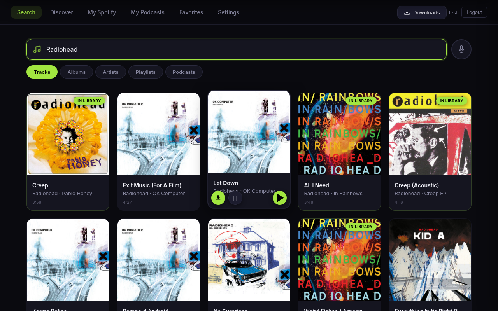
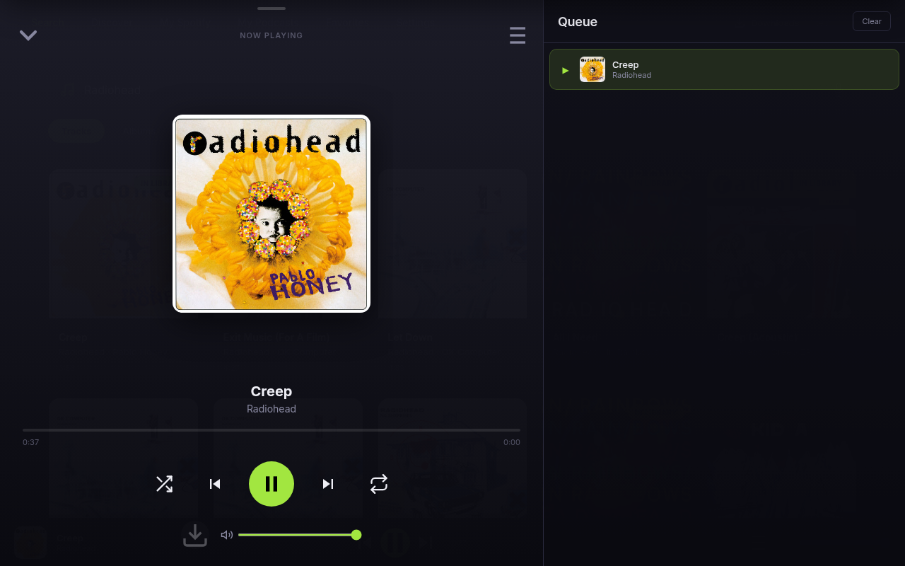
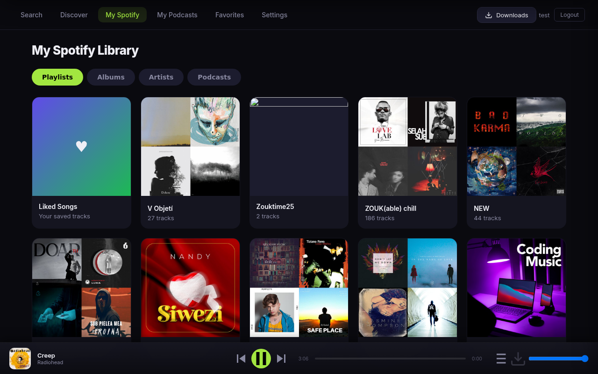

# MusicSeeker

A self-hosted web app for searching, downloading, and playing music. Think Jellyseerr, but for music.

Built with FastAPI + vanilla JS. Runs as a single Docker container.



## Features

### Search & Discovery
- **Multi-Provider Search** — Search tracks, albums, artists, and playlists via Deezer (default, no API key needed), YouTube Music, or Spotify — configurable in Settings with automatic fallback
- **Discover** — Browse music by genre tags (rock, jazz, electronic, etc.) powered by Last.fm, with infinite scroll and filtering by tracks, albums, or artists
- **Artist Detail View** — Click any artist to see their full discography, play radio, follow them, or download all albums at once
- **Album Browsing** — View album track listings with durations, download individual tracks or entire albums

### Downloads
- **Three download methods:**
  - **yt-dlp** — Download from YouTube in FLAC or MP3 with metadata (artist, title, album) and album art automatically embedded via metaflac/ffmpeg
  - **Soulseek (slskd)** — P2P downloads via Soulseek network, auto-selects best quality (prefers FLAC, higher bitrate)
  - **Lidarr** — Torrent-based downloads with automatic artist monitoring
- **Smart Downloads** — Checks your Navidrome library before downloading and skips tracks you already have
- **Download Management** — Real-time progress tracking with percentage and file size, retry failed downloads, cancel running jobs, download history panel with status badges

### Player
- **In-Browser Streaming Player** — Stream from local downloads (fastest), Navidrome, or YouTube via yt-dlp/ffmpeg proxy, with 4-hour URL caching
- **Source Badge** — Shows stream source (LOCAL / FLAC / YT) on mini player and full player so you know where audio is coming from
- **Full-Screen Player** — Slides up from mini player bar with large album art, seek bar, shuffle, and repeat (off/all/one). On desktop: split view with integrated queue panel
- **Swipe Gestures** — Swipe up on mini player to expand, swipe down to close. Swipe left/right on album art for next/previous track. Tap album art to play/pause
- **Queue Management** — Per-user persistent queue with drag & drop reorder (drag handle on each track). Add tracks, reorder, remove, clear. Save queue as Navidrome playlist
- **Media Session API** — Lock screen controls on mobile, headset button support

### Smart Recommendations
- **Playlist-Aware Recommendations** — Panel in full player queue sidebar suggests tracks based on your current queue/playlist context
- **Three sources** — Last.fm Similar Tracks + Deezer Artist Radio + Spotify Recommendations API — combined and deduplicated
- **Virtual Playback** — Click a recommendation to play it directly without adding to queue. Next recommendation plays automatically when track ends (like Spotify autoplay)
- **Add to Queue** — "+" button adds recommendation to actual queue. In Playlist Mode, also downloads and adds to Navidrome playlist
- **Add to Playlist(s)** — Playlist icon opens multi-select picker to add track to one or more Navidrome playlists (auto-downloads if not in library)

### Radio
- **Artist Radio** — Start an auto-generated station from any artist with the 📻 button
- **Three radio sources** — Deezer Artist Radio, Last.fm Track Radio, or Combined mode — configurable in Settings

### Favorites & New Releases
- **Follow Artists** — Heart icon to follow/unfollow artists from search results or artist detail
- **Favorites Page** — Browse all followed artists with images
- **New Release Detection** — Automatic background checks for new albums from followed artists, shown with "NEW" badges
- **Auto-Download** — Optional per-artist toggle to automatically download new albums when detected

### Spotify Integration
- **Per-User OAuth** — Authorize with Spotify directly from Settings (no manual token exchange needed). Per-user tokens stored securely
- **My Spotify Library** — Browse your Playlists, Saved Albums, Followed Artists, and Subscribed Podcasts in separate tabs
- **Liked Songs** — Access and download your Spotify Liked Songs as a playlist, with Navidrome playlist sync
- **Graceful Degradation** — Features that require Spotify credentials are greyed out when keys are missing

### Podcasts
- **Search & Download** — Search podcast episodes from Spotify, download individual episodes or entire shows
- **Subscriptions** — Subscribe to shows for automatic sync of new episodes (configurable interval)
- **Episode Management** — Filter episodes by name, bulk delete, manual sync check

### Library & Navidrome
- **Library Tab** — Browse all your Navidrome playlists with cover art. Play All, Queue All, or open playlist detail
- **Playlist Management** — Create, rename, duplicate, merge, and delete playlists directly from MusicSeeker
- **Playlist Mode** — Play All from a Library playlist links the queue to that playlist. Adding/removing tracks in queue auto-syncs to Navidrome. Badge shows linked playlist name. Persists across page refresh
- **Save Queue as Playlist** — Save button in queue header creates a new Navidrome playlist from current queue and activates Playlist Mode
- **Bulk Operations** — Select multiple tracks in playlist detail with checkboxes, then copy to other playlist(s) or remove
- **Drag & Drop Reorder** — Reorder tracks in queue via drag handle. In Playlist Mode, reorder syncs to Navidrome playlist
- **Multi-Playlist Picker** — Add tracks to multiple playlists at once with checkbox picker modal
- **Library Detection** — Shows "In Library" badge for tracks already in your Navidrome collection (fuzzy matching handles remasters, feat. tags, etc.)
- **Track & Album Deletion** — Delete track or album files from library via modal button, with confirmation showing affected playlists. Triggers Navidrome scan
- **Playlist Sync** — Creates Navidrome playlists after downloading album/playlist, triggers library scan automatically
- **Song Recognition** — Identify songs via your microphone using Shazam, with AcoustID fingerprinting as fallback, then download them instantly

### User Management
- **JWT Authentication** — Admin and user roles with per-user permissions
- **Per-User Permissions** — Restrict download formats (MP3/FLAC), methods (yt-dlp/slskd/Lidarr), and storage quotas per user
- **Per-User Download Folders** — Each user's downloads go to `/music/{username}/`, with disk usage tracking and admin cleanup
- **Browser Notifications** — Get notified when downloads complete (even in background tabs)

### UI
- **Modern Dark Theme** — Spotify-inspired design with lime green accent, Inter font, glassmorphism navigation
- **Responsive** — Desktop top nav with full layout, mobile bottom tab bar with bottom-sheet modals
- **No Build Step** — Entire frontend is a single HTML file served by FastAPI

## Screenshots

| Search Results | Download Modal | Discover |
|----------------|----------------|----------|
|  |  |  |

| Full Player (Desktop) | My Spotify Library | Mobile |
|-----------------------|-------------------|--------|
|  |  |  |

| Library Playlists | Playlist Detail | Recommendations |
|-------------------|-----------------|-----------------|
|  |  |  |

## Requirements

- Docker & Docker Compose
- *(Optional)* [Spotify Developer App](https://developer.spotify.com/dashboard) (needed for Spotify search provider, personal playlists, Liked Songs, and podcasts)
- *(Optional)* [slskd](https://github.com/slskd/slskd) instance for Soulseek P2P downloads (included in docker-compose)
- *(Optional)* Lidarr instance for torrent-based downloads
- *(Optional)* Navidrome instance for library detection and playlist sync
- *(Optional)* [Last.fm API key](https://www.last.fm/api/account/create) for genre-based discovery (Discover tab)
- *(Optional)* [AcoustID API key](https://acoustid.org/my-applications) for fingerprint-based recognition fallback

> **Note:** Search works out of the box with Deezer (default) or YouTube Music — no API keys required. Spotify credentials are only needed if you want to use Spotify as your search provider, browse your personal playlists/Liked Songs, or search podcasts.

## Quick Start

### 1. Clone the repository

```bash
git clone https://github.com/lucashanak/music-seeker.git
cd music-seeker
```

### 2. Configure environment

```bash
cp .env.example .env
```

Edit `.env` with your credentials:

```env
# Required
MUSIC_DIR=/music
ADMIN_USER=admin
ADMIN_PASS=your_secure_password

# Search provider (default: deezer). Options: deezer, ytmusic, spotify
SEARCH_PROVIDER=deezer

# Optional — Spotify (needed for Spotify search, playlists, Liked Songs, podcasts)
SPOTIFY_CLIENT_ID=your_client_id
SPOTIFY_CLIENT_SECRET=your_client_secret
SPOTIFY_REFRESH_TOKEN=your_refresh_token

# Optional (for Last.fm Discover tab)
LASTFM_API_KEY=your_lastfm_key

# Optional (for AcoustID recognition fallback)
ACOUSTID_API_KEY=your_acoustid_key

# Optional (for Lidarr integration)
LIDARR_URL=http://lidarr:8686
LIDARR_API_KEY=your_api_key

# Optional (for "In Library" detection and playlist sync)
NAVIDROME_URL=http://navidrome:4533
NAVIDROME_USER=your_user
NAVIDROME_PASSWORD=your_password

# Optional (for Soulseek downloads via slskd)
SLSKD_URL=http://slskd:5030
SLSKD_API_KEY=your_slskd_api_key
```

### 3. Start the app

```bash
docker compose up -d --build
```

This starts MusicSeeker, Navidrome, and slskd. The app will be available at `http://localhost:8090`.

- Navidrome: `http://localhost:4533` (configure on first access)
- slskd: `http://localhost:5030` (configure Soulseek credentials via its web UI)

### 4. Log in

Use the admin credentials you set in `.env`. You can create additional users from the Settings page.

## Download Methods

### yt-dlp (default)
Searches YouTube for the track and downloads the audio. Metadata (artist, title, album) and album art are sourced from the search provider (Deezer/Spotify) and embedded into the file. Supports FLAC and MP3 output formats.

### Soulseek (slskd)
Downloads from the Soulseek peer-to-peer network via a self-hosted [slskd](https://github.com/slskd/slskd) instance. Auto-selects the best quality file (prefers FLAC, higher bitrate). Requires a Soulseek account — see [Setting up slskd](#setting-up-slskd) below.

### Lidarr
Adds the artist to Lidarr and triggers a search. Lidarr handles the actual download via torrent indexers in the background. Good for monitoring entire discographies.

## Getting a Spotify Refresh Token

Search works without Spotify credentials using Deezer (default) or YouTube Music. Spotify credentials are only needed if you want to use Spotify as your search provider, browse your personal playlists/Liked Songs, or search podcasts. A refresh token is additionally needed for browsing your personal playlists and Liked Songs. When Spotify credentials are missing, dependent features are gracefully greyed out.

1. Go to [Spotify Developer Dashboard](https://developer.spotify.com/dashboard) and create an app
2. Set the Redirect URI to `http://localhost:8888/callback`
3. Note your **Client ID** and **Client Secret**
4. Open this URL in your browser (replace `YOUR_CLIENT_ID`):

```
https://accounts.spotify.com/authorize?client_id=YOUR_CLIENT_ID&response_type=code&redirect_uri=http://localhost:8888/callback&scope=user-read-private%20playlist-read-private%20playlist-read-collaborative%20user-library-read
```

5. After authorizing, you'll be redirected to `http://localhost:8888/callback?code=AUTHORIZATION_CODE`
6. Copy the `code` parameter and exchange it for tokens:

```bash
curl -X POST https://accounts.spotify.com/api/token \
  -H "Content-Type: application/x-www-form-urlencoded" \
  -d "grant_type=authorization_code" \
  -d "code=AUTHORIZATION_CODE" \
  -d "redirect_uri=http://localhost:8888/callback" \
  -d "client_id=YOUR_CLIENT_ID" \
  -d "client_secret=YOUR_CLIENT_SECRET"
```

7. The response will contain a `refresh_token` — put it in your `.env` file.

## Setting up slskd

slskd is a self-hosted Soulseek client included in the docker-compose file. To enable Soulseek downloads:

### 1. Configure Soulseek credentials

Create `slskd-data/slskd.yml` with your Soulseek username and password (slskd will register the account automatically if it doesn't exist):

```yaml
soulseek:
  username: your_soulseek_username
  password: your_soulseek_password

directories:
  incomplete: /music/.slskd-incomplete
  downloads: /music/.slskd-downloads

web:
  authentication:
    api_keys:
      - key: your-api-key-here
        role: administrator
```

See `slskd.yml.example` for a full example.

### 2. Create download directories

```bash
mkdir -p music/.slskd-incomplete music/.slskd-downloads
```

### 3. Start slskd

```bash
docker compose up -d slskd
```

### 4. Set the API key in MusicSeeker

Go to MusicSeeker **Settings** and paste your slskd API key (the `key` value from `slskd.yml`).

That's it — slskd will connect to the Soulseek network and MusicSeeker can now search and download via Soulseek.

## Integration with YAMS

If you're running [YAMS](https://yams.media) (Yet Another Media Server), add MusicSeeker to your `docker-compose.custom.yaml`:

```yaml
services:
  music-seeker:
    build: /path/to/music-seeker
    container_name: music-seeker
    restart: unless-stopped
    ports:
      - "8090:8090"
    environment:
      - SPOTIFY_CLIENT_ID=${SPOTIFY_CLIENT_ID}
      - SPOTIFY_CLIENT_SECRET=${SPOTIFY_CLIENT_SECRET}
      - SPOTIFY_REFRESH_TOKEN=${SPOTIFY_REFRESH_TOKEN}
      - LIDARR_URL=http://lidarr:8686
      - LIDARR_API_KEY=${LIDARR_API_KEY}
      - MUSIC_DIR=/music
      - NAVIDROME_URL=http://navidrome:4533
      - NAVIDROME_USER=your_user
      - NAVIDROME_PASSWORD=${NAVIDROME_PASSWORD}
      - LASTFM_API_KEY=${LASTFM_API_KEY}
      - SLSKD_URL=http://slskd:5030
      - SLSKD_API_KEY=${SLSKD_API_KEY}
      - ADMIN_USER=admin
      - ADMIN_PASS=${ADMIN_PASS}
    volumes:
      - /mnt/nas/Media/_Music:/music
      - ${INSTALL_DIRECTORY}/config/music-seeker:/app/data
```

## Architecture

```
┌──────────────────────────────┐
│        Browser (SPA)         │
│   Vanilla JS + Dark Theme    │
└────────────┬─────────────────┘
             │ HTTP/JSON
┌────────────▼─────────────────┐
│     FastAPI (main.py)        │
│  Auth, Search, Downloads,    │
│  Player, Recognition,        │
│  Discover, Favorites,        │
│  Podcasts, Settings          │
├──────────────────────────────┤
│ search_providers.py │ Deezer + YTMusic│
│ spotify.py  │ Spotify Web API│
│ lastfm.py   │ Last.fm API   │
│ radio.py    │ Recommendations │
│ downloader.py │ yt-dlp / slskd / Lidarr│
│ library.py  │ Subsonic API + Playlists│
│ recognize.py│ shazamio+acoustid│
│ podcasts.py │ Subscriptions   │
│ player.py   │ Streaming+Queue │
│ auth.py     │ HMAC tokens    │
│ jobs.py     │ Job queue      │
└──────────────────────────────┘
```

- **No database** — users and settings stored as JSON files in `/app/data`
- **No build step** — frontend is a single HTML file served by FastAPI
- **yt-dlp runs in-process** — downloads run as subprocesses with metadata post-processing (artist, title, album art from search provider)
- **slskd integration** — REST API calls to self-hosted Soulseek client
- **Streaming player** — multi-source resolution (local file > Navidrome > YouTube proxy) with per-user queue persistence

## API Reference

All endpoints (except login and version) require `Authorization: Bearer <token>` header.

| Method | Endpoint | Description |
|--------|----------|-------------|
| `GET` | `/api/version` | Get app version (public) |
| `POST` | `/api/auth/login` | Login, returns JWT token |
| `GET` | `/api/auth/me` | Get current user info |
| `GET` | `/api/search?q=...&type=track&offset=0` | Search music (via configured provider) |
| `POST` | `/api/download` | Start a download job |
| `GET` | `/api/jobs` | List all jobs |
| `GET` | `/api/jobs/:id` | Get job status |
| `DELETE` | `/api/jobs/:id` | Cancel a job |
| `POST` | `/api/jobs/:id/retry` | Retry a failed job |
| `DELETE` | `/api/jobs` | Clear download history |
| `POST` | `/api/library/check` | Check if items exist in Navidrome |
| `GET` | `/api/library/playlists` | List Navidrome playlists |
| `GET` | `/api/library/playlist/:id` | Get playlist with tracks |
| `POST` | `/api/library/playlist` | Create new playlist |
| `PUT` | `/api/library/playlist/:id/rename` | Rename playlist |
| `PUT` | `/api/library/playlist/:id/tracks` | Add tracks by song IDs |
| `PUT` | `/api/library/playlist/:id/reorder` | Reorder playlist tracks |
| `POST` | `/api/library/playlist/:id/add-by-name` | Add track by name/artist |
| `POST` | `/api/library/playlist/:id/add-and-download` | Add track (download if needed) |
| `POST` | `/api/library/playlist/:id/remove-by-name` | Remove track by name |
| `DELETE` | `/api/library/playlist/:id/tracks` | Remove tracks by indices |
| `DELETE` | `/api/library/playlist/:id` | Delete playlist |
| `POST` | `/api/library/track/delete` | Delete track file from disk |
| `POST` | `/api/library/track/check-playlists` | Check which playlists contain track |
| `POST` | `/api/library/album/delete` | Delete album files from disk |
| `GET` | `/api/library/cover/:id` | Proxy Navidrome cover art |
| `POST` | `/api/recognize` | Identify song from audio (multipart) |
| `GET` | `/api/spotify/playlists` | Get user's Spotify playlists |
| `GET` | `/api/spotify/liked` | Get user's Liked Songs |
| `GET` | `/api/spotify/playlist/:id/tracks` | Get playlist tracks |
| `GET` | `/api/discover/tags` | Get popular Last.fm genre tags |
| `GET` | `/api/discover/tag/:tag?type=track` | Get top items for a tag |
| `POST` | `/api/discover/resolve` | Resolve Last.fm item via search provider |
| `GET` | `/api/podcasts` | List downloaded podcast shows |
| `GET` | `/api/podcasts/:show` | List episodes for a show |
| `DELETE` | `/api/podcasts/:show` | Delete entire show |
| `DELETE` | `/api/podcasts/:show/:episode` | Delete single episode |
| `GET` | `/api/podcasts/subs` | List podcast subscriptions |
| `POST` | `/api/podcasts/subs` | Subscribe to a podcast |
| `DELETE` | `/api/podcasts/subs/:id` | Unsubscribe from a podcast |
| `PUT` | `/api/podcasts/subs/:id` | Update subscription settings |
| `POST` | `/api/podcasts/sync` | Manually sync all subscriptions |
| `GET` | `/api/player/stream?name=..&artist=..` | Stream audio (Navidrome or YouTube proxy) |
| `GET` | `/api/player/queue` | Get user's player queue |
| `PUT` | `/api/player/queue` | Save player queue state |
| `POST` | `/api/player/queue/add` | Add tracks to queue |
| `DELETE` | `/api/player/queue` | Clear player queue |
| `GET` | `/api/player/recommendations` | Get recommendations from queue |
| `POST` | `/api/player/recommendations` | Get recommendations from track list |
| `GET` | `/api/player/resolve-source?name=..&artist=..` | Resolve stream source type |
| `GET` | `/api/radio?track=..&artist=..` | Get radio tracks |
| `GET` | `/api/settings` | Get app settings |
| `PUT` | `/api/settings` | Update settings (admin only) |
| `GET` | `/api/users` | List users (admin only) |
| `POST` | `/api/users` | Create user (admin only) |
| `DELETE` | `/api/users/:username` | Delete user (admin only) |
| `PUT` | `/api/users/:username/password` | Change password |
| `GET` | `/api/admin/disk-usage` | Get per-folder disk usage (admin) |
| `DELETE` | `/api/admin/disk-usage/:dirname` | Delete a download folder (admin) |

## Environment Variables

| Variable | Required | Default | Description |
|----------|----------|---------|-------------|
| `SEARCH_PROVIDER` | No | `deezer` | Search provider: `deezer`, `ytmusic`, or `spotify` |
| `SPOTIFY_CLIENT_ID` | No | — | Spotify app Client ID (needed for Spotify search, playlists, podcasts) |
| `SPOTIFY_CLIENT_SECRET` | No | — | Spotify app Client Secret |
| `SPOTIFY_REFRESH_TOKEN` | No | — | Spotify OAuth refresh token (only needed for your own playlists) |
| `ADMIN_USER` | Yes | `admin` | Initial admin username |
| `ADMIN_PASS` | Yes | — | Initial admin password |
| `MUSIC_DIR` | No | `/music` | Music dir inside the container |
| `LIDARR_URL` | No | `http://lidarr:8686` | Lidarr API URL |
| `LIDARR_API_KEY` | No | — | Lidarr API key |
| `NAVIDROME_URL` | No | `http://navidrome:4533` | Navidrome URL |
| `NAVIDROME_USER` | No | — | Navidrome username |
| `NAVIDROME_PASSWORD` | No | — | Navidrome password |
| `SLSKD_URL` | No | `http://slskd:5030` | slskd REST API URL |
| `SLSKD_API_KEY` | No | — | slskd API key (set in `slskd-data/slskd.yml`) |
| `LASTFM_API_KEY` | No | — | Last.fm API key for Discover tab |
| `ACOUSTID_API_KEY` | No | — | AcoustID API key for fingerprint recognition fallback |
| `LIDARR_ROOT_FOLDER` | No | `{MUSIC_DIR}/_lidarr` | Root folder path as seen by Lidarr |
| `PODCAST_SYNC_HOURS` | No | `6` | Auto-sync interval for podcast subscriptions (hours) |
| `JWT_SECRET` | No | auto-generated | Secret for signing auth tokens |

## License

MIT
