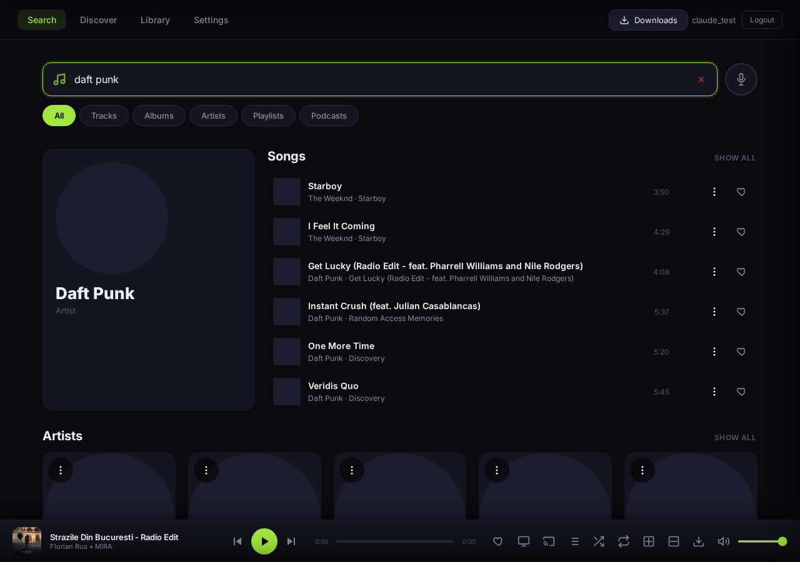
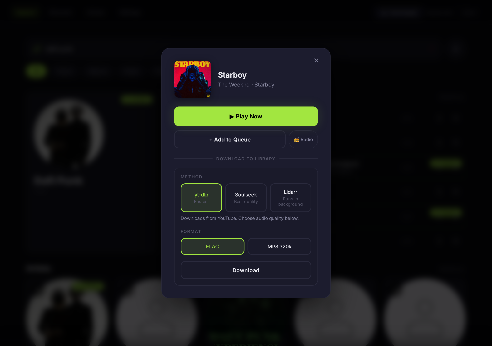
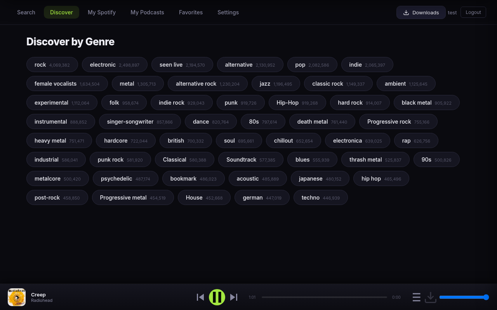
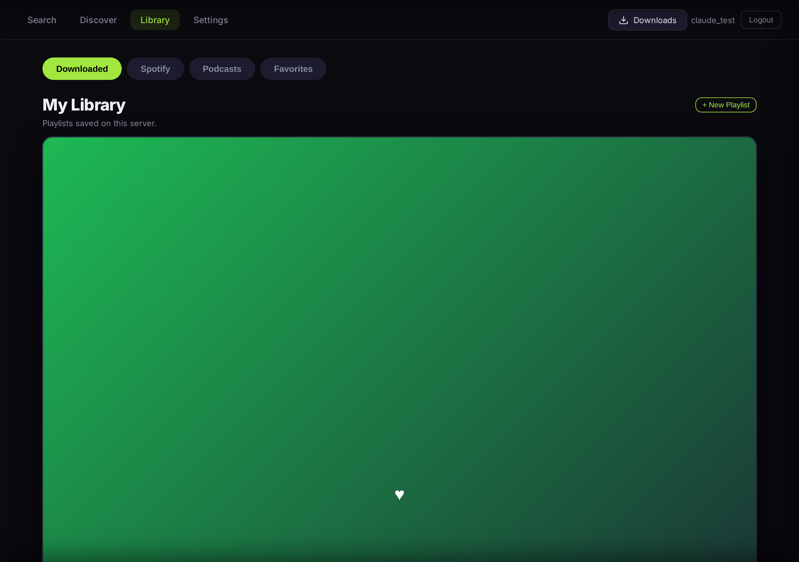
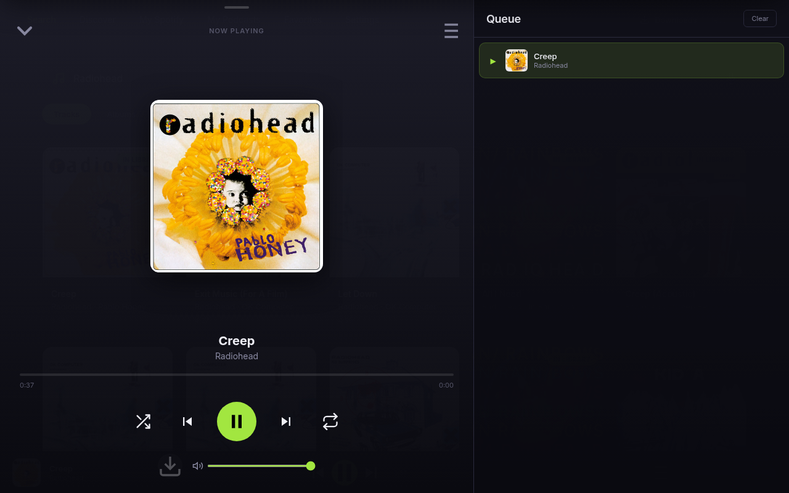
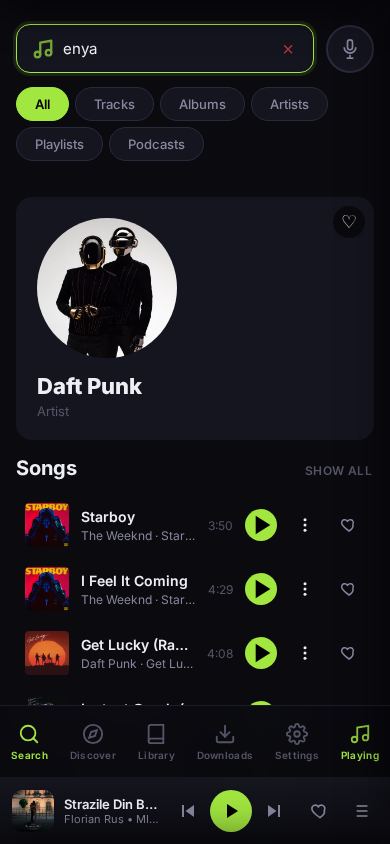
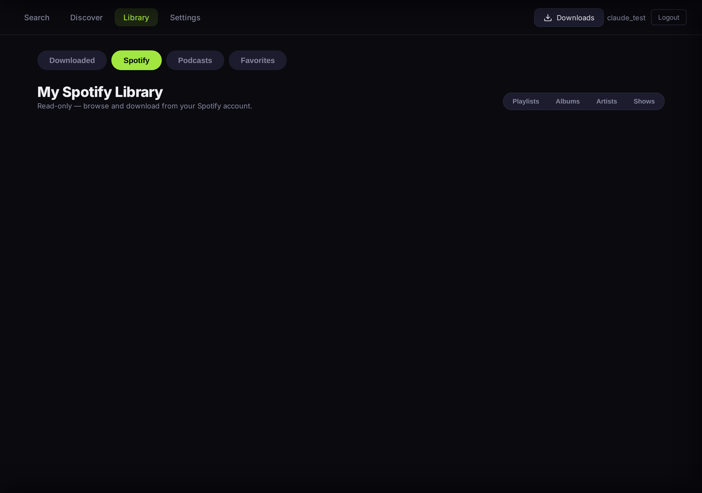
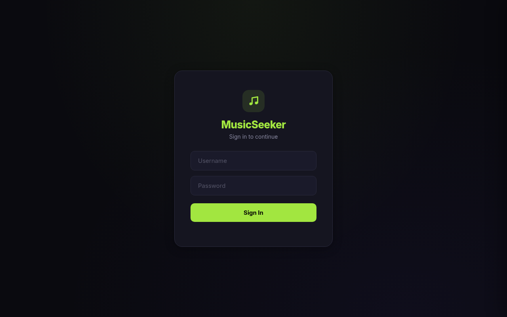
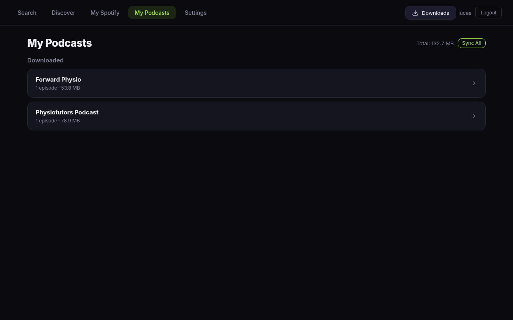
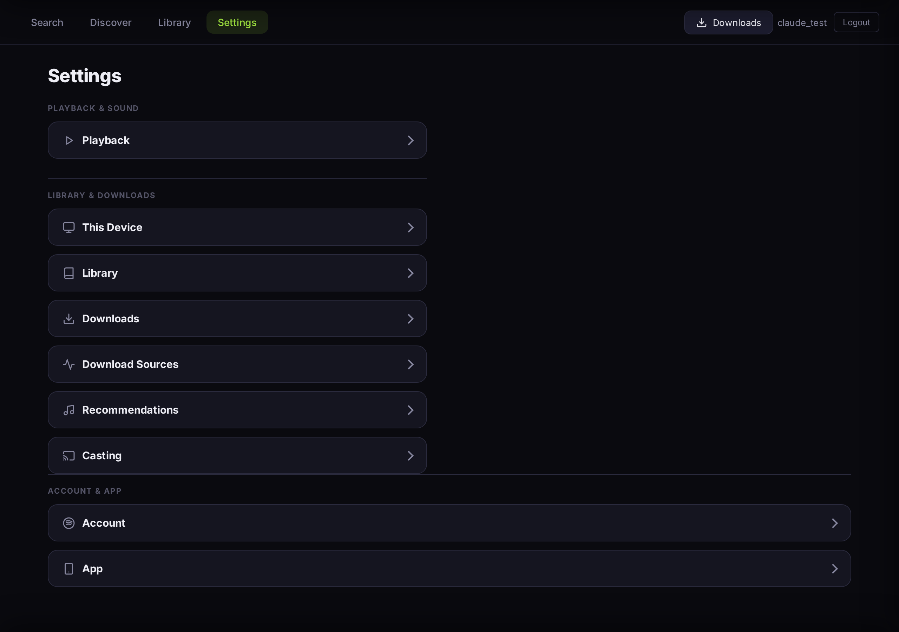

# MusicSeeker

A self-hosted web app for searching, downloading, and playing music. Think Jellyseerr, but for music.

Built with FastAPI + vanilla JS. Runs as a single Docker container. Native apps for macOS and Android.



## Features

### Search & Discovery
- **Aggregated search** — unified "All" tab with top result + songs, artists, albums, playlists in one query (Spotify-style)
- **Per-type search** — dedicated tabs for tracks, albums, artists, playlists, podcasts
- **Multi-provider** — Deezer (default, no API key), YouTube Music, or Spotify with automatic fallback
- **Case-insensitive, diacritics-aware** — search "beyonce" to find "Beyoncé"
- **Discover** — genre-based browsing via Last.fm tags with infinite scroll
- **Artist detail** — discography, radio, follow, bulk download

### Downloads & Playback
- **Smart playback** — Play Now, Add to Queue, or Radio from any track
- **Download modal redesign** — clear separation of playback (Play Now / Add to Queue / Radio) vs. library download (Method + Format)
- **Download methods**:
  - **yt-dlp** (Fastest) — YouTube audio in FLAC/MP3 with embedded metadata and album art
  - **Soulseek (slskd)** (Best quality) — P2P downloads, auto-selects best quality
  - **Lidarr** (Runs in background) — torrent-based with artist monitoring
- **Smart downloads** — skips tracks already in your Navidrome library
- **Job management** — real-time progress, retry, cancel, history

### Player & Mobile
- **Multi-source streaming** — local file > Navidrome > YouTube proxy (4h URL cache)
- **Full-screen player** — album art, seek bar, shuffle, repeat (off/all/one), grouped action row (DJ / track / output)
- **Queue management** — drag & drop reorder, per-user persistent, save as Navidrome playlist, always visible on touch
- **Playlist Mode** — queue linked to Navidrome playlist with auto-sync
- **Multi-device** — separate queue and play progress per device, with device naming
- **Output modes** — Default (local + cast), Local Only, DLNA Only (auto-connects on play)
- **Source badge** — shows LOCAL / FLAC / YT on mini and full player
- **Mobile optimizations** — mini-player shows essentials only (play/pause, like, queue), full player has all controls
- **Swipe gestures** — expand player, next/prev track, tap to play/pause
- **Keyboard shortcuts** — Space (play/pause), arrows (skip, volume)

### Recommendations & Radio
- **Smart recommendations** — context-aware suggestions from Last.fm + Deezer + Spotify
- **Virtual playback** — play recommendations without adding to queue
- **Artist radio** — auto-generated stations with configurable source

### Spotify Integration
- **Per-user OAuth** — authorize directly from Settings
- **Browse** — playlists, Liked Songs, saved albums, followed artists, podcasts
- **Download & sync** — download Spotify playlists to Navidrome

### Library
- **Organized tabs** — Downloaded (your Navidrome playlists + Liked Songs), Spotify (read-only mirror), Podcasts, Favorites
- **Spotify tab** — Playlists, Albums, Artists, Shows segmented control for easy browsing
- **Quick search** — "In Library" badge with fuzzy matching on all search results

### Playlist Management (Spotify-style)
- **Inline creation** — create playlists from "Add to playlist" with name + description
- **Cover images** — set playlist cover from URL
- **Drag-to-reorder** — reorder tracks within playlists
- **Undo on delete** — 5-second toast to recover deleted playlists
- **Themed modals** — no browser prompts for better UX
- **Track/album deletion** — with confirmation showing affected playlists

### Library & Recognition
- **Song recognition** — Shazam + AcoustID fingerprinting via microphone

### Favorites & New Releases
- **Follow artists** — heart icon from search or artist detail
- **New release detection** — automatic background checks with "NEW" badges
- **Auto-download** — optional per-artist toggle for new albums

### Podcasts
- **Search & download** — individual episodes or entire shows
- **Subscriptions** — auto-sync new episodes on configurable interval

### DLNA/UPnP Cast
- **Cast to network speakers** — auto-discovers renderers via SSDP
- **Full control** — play, pause, stop, seek, volume from MusicSeeker UI
- **Per-device sessions** — each device has its own independent cast session
- **Metadata** — sends title, artist, album art to renderer display

### Native Apps
- **macOS** — standalone window with dock icon, keyboard shortcuts for reload/cache clear
- **Android** — background audio playback, media notification with play/pause/skip controls and progress bar, microphone access for Shazam
- **Auto-update** — checks for new versions, shows update banner in Settings
- [Full native apps documentation](docs/native-apps.md)

### Settings
- **Organized groups** — "Playback & Sound", "Library & Downloads", "Account & App", "Admin" (admin-only)
- **User management** — JWT auth with admin and user roles
- **Per-user permissions** — restrict formats (MP3/FLAC), methods (yt-dlp/slskd/Lidarr), storage quotas
- **Device management** — register, name, and configure devices per user
- **Per-user folders** — downloads go to `/music/{username}/` with disk usage tracking

### Navigation & UI
- **Consolidated nav** — 4 top-level items (Search / Discover / Library / Settings) + Downloads button + user/logout
- **Mobile nav** — bottom tab bar with Search / Discover / Library / Downloads / Settings, plus "Playing" pill
- **Dark theme** — Spotify-inspired with lime green accent
- **Responsive** — desktop top nav, mobile bottom tab bar with safe-area insets
- **No build step** — single HTML file, vanilla JS modules

## Screenshots

| Search Results | Download Modal | Discover |
|----------------|----------------|----------|
|  |  |  |

| Library | Full Player (Desktop) | Mobile |
|---------|----------------------|--------|
|  |  |  |

| My Spotify | Login | Podcasts | Settings |
|-----------|-------|----------|----------|
|  |  |  |  |

## Quick Start

### 1. Clone

```bash
git clone https://github.com/lucashanak/music-seeker.git
cd music-seeker
```

### 2. Configure

```bash
cp .env.example .env
```

Edit `.env`:

```env
# Required
ADMIN_USER=admin
ADMIN_PASS=your_secure_password

# Optional — see docs/configuration.md for all options
SPOTIFY_CLIENT_ID=your_client_id
SPOTIFY_CLIENT_SECRET=your_client_secret
LASTFM_API_KEY=your_lastfm_key
```

### 3. Start

```bash
docker compose up -d --build
```

This starts MusicSeeker (`:8090`), Navidrome (`:4533`), and slskd (`:5030`).

### 4. Log in

Open `http://localhost:8090` and log in with the `ADMIN_USER` / `ADMIN_PASS` you set in `.env`. There is no public sign-up — the admin is the first account, and you create everyone else from **Settings → Users**.

> **Important:** `ADMIN_PASS` must be set **before the first startup**. The admin account is created only once, on the first launch when the data directory is still empty. Changing `ADMIN_PASS` afterwards has **no effect** — to change the admin password later, use **Settings → Users** (or delete `data/users.json` and restart to recreate the admin). If you start the stack without `ADMIN_PASS`, **no account is created and login is impossible** (you'll see a `WARNING: ADMIN_PASS not set!` line in the container logs).

> **Note:** Search works out of the box with Deezer — no API keys required. Spotify credentials are only needed for personal playlists, Liked Songs, and podcasts.

### Can't log in?

- **"Invalid username or password" for the admin** — `ADMIN_PASS` was probably empty on first start, so no account exists, or it was changed after first start (which is ignored). Check the logs (`docker compose logs music-seeker`) for `WARNING: ADMIN_PASS not set!`. Fix: set `ADMIN_PASS` in `.env`, then `rm data/users.json` and `docker compose restart music-seeker` to recreate the admin (this only removes accounts, not your music).
- **Was logged in, now rejected** — tokens are signed with `JWT_SECRET`. It's auto-generated and persisted to `data/jwt_secret`, so it survives restarts; existing logins only break if that file is deleted or you set a different `JWT_SECRET`.
- **Too many login attempts** — after 5 failed tries from one IP the app returns HTTP 429 for 5 minutes. Just wait.

## Requirements

- Docker & Docker Compose
- *(Optional)* [Spotify Developer App](https://developer.spotify.com/dashboard)
- *(Optional)* [Last.fm API key](https://www.last.fm/api/account/create)
- *(Optional)* [AcoustID API key](https://acoustid.org/my-applications)
- *(Optional)* Lidarr instance

## Documentation

| Document | Description |
|----------|-------------|
| [Configuration](docs/configuration.md) | All environment variables and in-app settings |
| [Setup Guides](docs/setup-guides.md) | Spotify, slskd, Navidrome, Last.fm, Lidarr, DLNA, YAMS |
| [Architecture](docs/architecture.md) | Backend structure, frontend modules, data storage, Docker |
| [API Reference](docs/api-reference.md) | All ~90 REST API endpoints |
| [Native Apps](docs/native-apps.md) | macOS & Android apps — installation, features, building, auto-update |
| [Spotify Usage](SPOTIFY_USAGE.md) | How Spotify tokens are used, what needs an account, provider fallbacks |
| [Onkyo eISCP](docs/onkyo-eiscp.md) | eISCP protocol notes for Onkyo receiver input switching (DLNA cast) |
