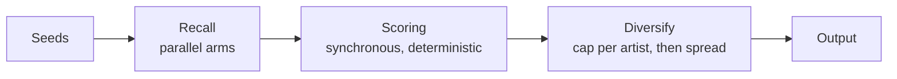

# How radio and recommendations are generated

Three different things in the UI produce "tracks like this", and they run three
different code paths. This document describes what each one actually does, which
signals it uses, and what has been measured about how well they work.

| In the UI | Endpoint | Backend function |
|---|---|---|
| Radio from an artist or track | `GET /api/radio` | `radio.get_radio_tracks` |
| Context menu → "More like this" | `GET /api/radio/track` | `radio.get_track_radio` |
| Recommendations under the queue / playlist | `POST /api/player/recommendations` | `radio.get_playlist_recommendations` |

All three share the same three-stage shape:



Stage 2 and 3 can only reorder what stage 1 found. That matters more than it
sounds — see [Measured behaviour](#measured-behaviour).

---

## 1. Artist / track radio — `/api/radio`

The simplest path. No profile, no scoring, no diversify pass.

`get_radio_tracks(source, track, artist, artist_id, limit)` switches on the
`recommendation_source` setting:

- **`deezer`** — resolve the artist name to a Deezer ID, call Deezer's artist
  radio endpoint, truncate to `limit`.
- **`lastfm`** — `track.getSimilar`; if that returns nothing, fall back to
  `artist.getSimilar` → each similar artist's top 5 tracks. Results are resolved
  through the configured search provider to pick up cover art and IDs.
- **`combined`** (default) — run both, then **interleave** them one-for-one and
  dedupe by normalized `(name, artist)`.

The frontend (`radio.js startRadio`) switches the playback context to the Radio
temp playlist and plays the result.

> Deezer's artist-radio endpoint is randomized on their side, so this path
> returns a different set every call even for the same seed. That is a feature
> here, but it is why request-level reproducibility is impossible without
> freezing the pool (see [Determinism](#determinism)).

---

## 2. Seed-track radio — `/api/radio/track`

"More like this ONE track." Deliberately **not** `get_playlist_recommendations`
with a single seed: that function blends in the durable taste profile at weight
0.6, which pulls results away from the seed's own character.

### Recall arms (parallel, each degrades to `[]`)

| Arm | Source | Notes |
|---|---|---|
| `similar` | Last.fm `track.getSimilar` (50) | Primary. Carries a `match` score 0–1 |
| `tag` | The **seed's own** top tags → `tag.getTopTracks` | Also collects `seed_tags` for scoring |
| `deezer` | Deezer artist radio for the seed's artist | Artist-level, so broader than the seed |
| `navidrome` | Subsonic `getSimilarSongs2` | Library-grounded — these are tracks you own |
| `cooccur` | Public-playlist co-occurrence | Cache-only on the request path, see §4 |

### Scoring

Synchronous and deterministic, per candidate:

```
score  = 3.5 · lastfm_match
       + 2.0 · (number of arms that found it)
       + 0.3 · log(1 + co_count)              # co-occurrence, if enabled
       + 6.0 · cosine(seed_tags, cand_tags)   # track-level tag vectors
       + 1.5   if found via Navidrome         # you already own it
       + tempo_coherence(seed_bpm, camelot)   # ±8 BPM band + Camelot
       + 1.5 · feature_coherence              # energy/danceability vs seed
       − 4.0   for the seed's own artist after the first hit
```

With `vibe=calm` or `vibe=energy` two more things happen:

- **A hard gate.** `calm` rejects anything outside 58–86 BPM (with a ÷2/×2 fold,
  and unknown BPM is kept) or with measured energy/danceability above 0.55.
- **Tag steering.** ±2.0 per tag in the calm/energy sets, symmetric — calm
  rewards `calm` tags and penalizes `energy` tags, and vice versa. `energy` also
  adds `2.0 · energy + 1.0 · danceability` from cached audio features.

Then sort descending and hand off to the shared diversify pass (§6).

---

## 3. Playlist / queue recommendations — `/api/player/recommendations`

The endless station under the queue. This is the elaborate one.

### 3.1 Profile

Two profiles are built and blended:

**Queue profile** (`_build_profile`, cached 10 min by playlist hash):
- `artist_weights` — normalized artist frequency in the seed tracks, top 8
- `tags` — Last.fm artist tags of the top 5 artists, weighted by
  `rank_decay × artist_weight × (count/100 + 0.3)`, top 5 kept
- `tag_vector` — IDF-weighted centroid of the **track-level** tag vectors of the
  first 30 tracks

**Taste profile** (`_build_taste_profile`, cached 10 min per user): Spotify liked
+ top tracks → Navidrome starred + top-played → `None`. Falls through cleanly.

> The Spotify leg is currently dead: the API answers 403 *"Active premium
> subscription required for the owner of the app"* on every endpoint, so the
> taste profile is Navidrome-only until that subscription is restored.

They are merged at `taste_weight = 0.6` — artist weights, tag weights and the tag
vector all blended, then renormalized.

### 3.2 Seeds

`_weighted_sample_seeds` picks 5 seeds weighted by artist frequency, with a 50%
chance of skipping a duplicate artist to keep the seed set varied.

The RNG is **seeded from the hash of the input tracks** plus a `variation`
argument, not drawn from the global `random`. Variety therefore comes from the
input changing (the endless station slides its seed window) rather than from
ambient randomness, and the same request twice gives the same seeds.

### 3.3 Recall arms

| Arm | What it does | Fan-out |
|---|---|---|
| A `seed_radio` | Combined radio per seed | top 3 seeds × 10 |
| B `artist_radio` | Deezer artist radio per top artist | top 3 artists × 10 |
| C `tag` | `tag.getTopTracks` for the profile's top tags | top 3 tags × 15 |
| D `similar_artists` | Top artist → 6 similar artists → 3 top tracks each | 1 chain |
| F `navidrome` | `getSimilarSongs2` per seed | top 3 seeds × 15 |
| G `cooccur` | Public-playlist co-occurrence | up to 400 |

(There is no arm E: it was Spotify's seed-based `recommendations` endpoint, which
has 404'd since November 2024 and was removed.)

Candidates are keyed by normalized `(name, artist)` and merged, tracking **which
arms found each one**, the best `match`, and the best `co_count`.

### 3.4 Scoring

```
score  = 2.0 · (number of arms that found it)   # strongest single signal
       + 0.3 · log(1 + co_count)
       + 3.0 · lastfm_match
       + 6.0 · cosine(profile_tag_vector, cand_tag_vector)
       + 0.5   if the artist is already in the playlist
       + 1.5   if Navidrome surfaced it
       + tempo_coherence(...)                   # only when tempo_coherent=true
       − 4.0   if the artist was skipped before
       + 2.0   if the artist was accepted before
```

`skipped` / `accepted` come from the frontend, which keeps a 14-day feedback log
in `localStorage` (`ms_recs_feedback_v1`) and sends the last 30 of each.

Candidate tag vectors are **not** fetched on the request path — scoring uses
whatever is already cached and the rest is warmed in the background. Fetching
even the top 40 synchronously produced an intermittent ~30s response, because the
pool shifts every request (Deezer's artist radio is randomized server-side) so
most requests met some uncached candidates. Four identical production requests
measured 2.1s, 3.0s, **31.0s**, 3.2s. After moving the fetch off the request
path, six requests measured 2.4–6.8s with no spike.

### 3.5 The endless station

`recommendations.js` keeps the recommendation queue topped up:

- **Top up** when fewer than 5 recommendations remain ahead of the playhead.
- **Drift** by re-seeding from a sliding window of the last 8 played
  recommendations blended with the tail of the original seed.
- **Re-anchor** every 6 top-ups by folding the original seed back in, so the
  station cannot drift indefinitely off-taste.

---

## 4. Co-occurrence recall

The newest arm, and the one that addresses the actual bottleneck.

### Why it exists

The other arms all measure *content similarity* — shared tags, similar artists,
similar tracks. That fails completely for a playlist defined by **use** rather
than genre. This library's zouk playlists are full of French pop, Romanian dance
and mainstream R&B: tracks chosen because they work for zouk *dancing*. Last.fm
has no track tags for them at all, and their artist tags say "pop". No
content-similarity signal can connect them.

But the people who build public zouk playlists put the same tracks together.
That co-occurrence is the missing signal.

### How it works

1. **Anchors in.** A scene anchor is something the user has already said: the
   name of the playlist being played (`store.playlistMode.name`, sent as
   `anchors`), or the `discovery_genres` setting. Profile tags are used only as a
   last resort.
2. **Queries out.** `derive_queries` tokenizes each anchor — including camelCase,
   so `MyZouk` yields `zouk` — drops words that name no scene (`my`, `mix`,
   `copy`, …), then expands surviving terms through the scene map in
   `tagvec._CONCEPTS`. So `zouk` becomes the whole family: `brazilian zouk`,
   `soulzouk`, `cabo love`, `kizomba`, `tarraxinha`, …
3. **Mine.** Deezer playlist search per query (playlists between 5 and 500
   tracks — smaller has no signal, larger is a genre dump), then fetch each
   playlist's tracks and count how many mined playlists contain each track. That
   count is `co_count`.
4. **Cache.** Query results for 7 days, playlist contents for 14, in
   `/app/data/cooccur.json` with an atomic write.

**The request path never mines.** It answers from cache only and kicks mining off
in the background, because mining a cold anchor adds up to ~9 seconds to the
response and only has to happen once per anchor per week. The first request for a
new anchor gets no co-occurrence; within a minute of normal use, every subsequent
one does.

### The anchor must come from you

This was tested, not assumed. Three local LLMs were given the playlist name
`MyZouk` plus 20 of its tracks and asked for mining queries:

| Queries from | Example output | Recall of held-out MyZouk members |
|---|---|---|
| Hand-written zouk terms | `brazilian zouk`, `kizomba` | **12.9%** |
| `gpt-oss-120b` | `chill indie pop`, `world lounge vibes` | 2.9% |
| `qwen3.6-35b` | `french pop hits`, `romanian dance hits` | 2.9% |
| `granite-4-tiny` | `latin dance beats playlist` | 0.7% |

The models were not wrong about the music — M. Pokora really is French pop. The
zouk-ness is not in the metadata; it is in how the tracks are used. So the anchor
is taken as given and expanded, never inferred.

Anchoring on **artist names** was also tried and is much weaker (2.9%): Deezer
playlist search matches playlist *titles*, not contents, so searching an artist
finds playlists named after them rather than playlists containing them.

---

## 5. Tag vectors

Replaces the original scoring signal, which compared **artist**-level Last.fm
tags with an integer set-overlap count. Two problems with that: an artist's tag
set is identical for their ballad and their club remix, and sharing "pop" counted
exactly as much as sharing "tarraxinha".

`tagvec` stores a per-**track** tag vector, IDF-weights it so rare defining tags
dominate generic ones, and compares with cosine similarity.

Two mechanisms handle the fact that Last.fm tags are free text:

- **Token expansion** — a multi-word tag also contributes its individual words at
  lower weight, so `brazilian zouk` and `zouk love` meet on `zouk`. A stoplist
  keeps `zouk love` and `love songs` from meeting on `love`.
- **Concept map** — for family members that share no spelling at all
  (`kizomba` ↔ `tarraxinha`).

Without these, exact-match cosine scored two obviously-similar zouk tracks at
0.0008 while a random pop track scored 0.0228, because the zouk tracks' tags were
different strings. With them: 0.498 versus 0.0025.

Cached permanently in `/app/data/tag_vectors.json`. The cache is the point —
track tags cost one Last.fm call each, so without it the reco path re-paid ~150
calls (~7.5s) per request. A request fetches vectors for its 40 most promising
candidates and warms the rest in the background.

**Coverage is the weak spot**: of ~3,500 cached entries only ~190 have real
track-level tags. The rest fall back to artist tags (discounted 0.6) or have no
tags at all. Last.fm simply does not have track tags for this material.

---

## 6. Selection and spread

Both scored paths end in `_diversify`, which does two separate jobs:

**Selection** is strictly score-ordered, keeping at most
`DIVERSIFY_MAX_PER_ARTIST` (4) tracks per artist. This is load-bearing for
recall: selecting round-robin across artists instead — one each, then a second
each — **halved** recall in the eval, 0.071 → 0.035, and it did so for the
baseline variant too. Curated playlists cluster several tracks per artist, so
breadth-first selection drops exactly the members being looked for.

**Spread** then reorders that chosen list so the same artist is not adjacent,
picking the earliest remaining track whose artist differs from the previous one.
This changes order only, never the set, so recall@limit is untouched. Before it,
production returned 4 tracks by one artist in the top 6; after, the head reads
`M. Pokora | Sheryfa Luna | M. Pokora | Jason Derulo | M. Pokora | Beyoncé | …`
with 15–16 distinct artists per 20 results.

When every remaining track is by the same artist the pass emits it anyway rather
than looping — an unavoidable adjacency at the tail is fine.

---

## 7. Measured behaviour

`test_reco_eval.py` measures all of this against ground truth: the user's own
curated Navidrome playlists. Give the engine 5 tracks from a playlist as seeds
and count how many of the **held-out** members it recovers.

Averaged over 3 independent seed draws, 5 playlists. Absolute levels move
between runs because the recall arms hit live, partly randomized APIs; the
**delta** is the stable quantity, and it has held at roughly +0.013 recall@20 and
+0.011 recall@50 across every run since the pool was frozen:

| Variant | recall@20 | recall@50 | hits@50 | off-genre | Last.fm calls |
|---|---|---|---|---|---|
| Baseline (artist tags, no co-occurrence) | 0.163 | 0.071 | 17.3 | 0 | 240 |
| Tag vectors only | 0.157 | 0.071 | 17.3 | 0 | 66 |
| Co-occurrence only | 0.190 | 0.086 | 21.0 | 0 | 872 |
| **Both** | 0.177 | 0.083 | 20.3 | 0 | **66** |

Three things worth internalizing from this:

**Recall was the bottleneck, not ranking.** The original arms together produced a
candidate pool of about **80 tracks**, roughly 3% of which were members of the
playlist the seeds came from. Tag vectors only reorder that pool, which is why
they measured flat on their own — and why they only start paying off once
co-occurrence has grown the pool to ~400.

**The per-artist cap interacts with pool size.** It was hardcoded at 2. With a
large pool that discards genuine playlist members in favour of higher-scored
tracks by the same artist. Measured hits@20 by cap: 2→7, 3→8, 4→9, 6→10. It is
now 4 — most of the gain, without letting one artist take an eighth of the page.

**Anchor quality dominates everything.** With the per-artist cap lifted entirely,
a playlist whose name names its scene had **49 of 53** held-out members reachable
in the pool. A playlist whose name does not had a fraction of that. No scoring
change comes close to that effect size.

### What still does not work

`MyZouk` recovers **zero** held-out members under every configuration tested.
Its scene is not recoverable from any signal currently available:

- Last.fm has no track tags for its members and its artist tags say "pop"
- the audio features do not separate it either — its energy (0.6, IQR 0.5–0.7)
  and danceability (0.4, IQR 0.3–0.5) are *identical* to the whole analyzed
  library, and its BPM distribution is barely tighter
- what actually connects the tracks is rhythmic feel, which scalar
  `energy` / `danceability` / `bpm` do not capture

---

## Determinism

The engine is deterministic given a fixed candidate pool: seeds come from a
seeded RNG, and scoring is synchronous with no ambient randomness.

The **pool** is not, and cannot be — Deezer's artist radio is randomized server
side and arms fail intermittently. Two identical requests therefore return
different recommendations in production, which is desirable.

For measurement that is fatal, so `test_reco_eval.py` memoizes the network leaves
(`deezer_search`, `deezer_artist_radio`, `resolve`, `search`,
`get_similar_songs`) so that every variant scores the *same* API responses. It
also warms the tag cache to a fixed point first, and averages over several seed
draws via the `variation` argument. Before that was in place, the noise was
larger than the effects: one unfrozen run put the baseline above the best variant
and the next run reversed it.

---

## Caches

| Cache | Location | TTL |
|---|---|---|
| Last.fm responses | in-process | 10 min |
| Queue profile | in-process, keyed by playlist hash | 10 min |
| Taste profile | in-process, per user | 10 min |
| Track tag vectors | `/app/data/tag_vectors.json` | permanent |
| Co-occurrence queries | `/app/data/cooccur.json` | 7 days |
| Co-occurrence playlist contents | `/app/data/cooccur.json` | 14 days |
| Audio analysis (BPM, key, energy…) | `/app/data/bpm_analysis.json` | permanent |
| Resolved stream URLs | in-process | 4 hours |

The two persistent JSON caches are written atomically (temp file + `os.replace`),
because each represents hours of rate-limited API work that a torn write would
destroy.

---

## Configuration

| Setting | Where | Effect |
|---|---|---|
| `recommendation_source` | app settings | `deezer` / `lastfm` / `combined` for the radio path |
| `discovery_genres` | app settings | Comma-separated scene anchors for co-occurrence |
| `search_provider` / `search_fallback` | app settings | Which provider resolves Last.fm tracks to playable ones |
| `RECO_TAG_VECTORS` | env | Enables track-level tag-vector scoring |
| `RECO_COOCCUR` | env | Enables the co-occurrence arm |
| `LASTFM_API_KEY` | env | **Without it, arms A(partly), C, D and all tag scoring are dead** |
| `tempo_coherent` | per request | Enables BPM/Camelot coherence in playlist recommendations |

Tunables live at the top of `app/services/radio.py`: `TAGVEC_WEIGHT`,
`TAGVEC_CANDIDATE_BUDGET`, `TAGVEC_PROFILE_BUDGET`, `COOCCUR_WEIGHT`,
`COOCCUR_LIMIT`, `DIVERSIFY_MAX_PER_ARTIST`.

---

## Known gaps

- **Track-tag coverage** is ~5% of cached entries; the rest run on discounted
  artist tags.
- **No rhythmic features.** The one thing that would characterize a
  dance-defined playlist is not computed.
- **`get_track_radio` cannot use the seed's own tags as a co-occurrence anchor**,
  because the arms run concurrently and the tags are gathered by a sibling arm.
  It uses the configured genres only.
